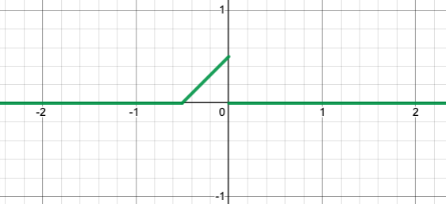
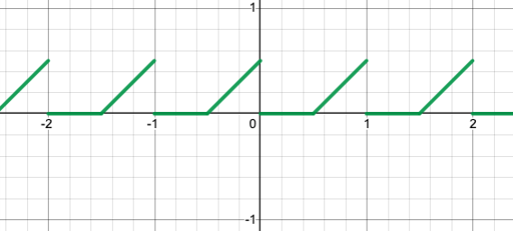
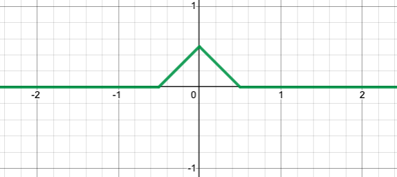
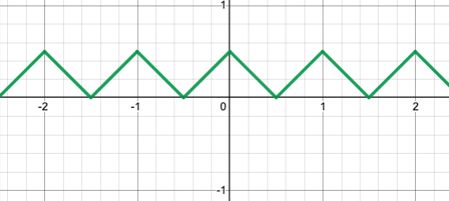
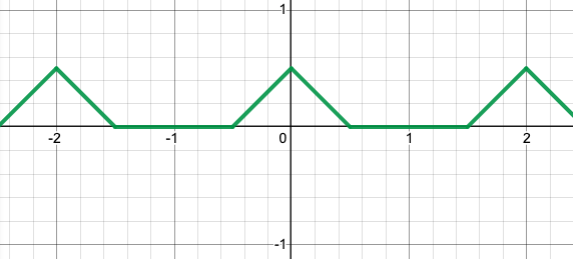

# Formule de Poisson

Si on a $x(n) = x_a(nT_e)$, on peut alors écrire :

$$\hat{x}(\nu) = \sum_{n=-\infty}^{+\infty}x_a(nT_e) e^{-2i\pi\nu n}= \frac{1}{T_e}
\sum_{k=-\infty}^{+\infty}\hat{x_a}((\nu+k)F_e)$$

Autrement dit, discrétiser dans le domaine fréquentiel, revient à périodiser dans le domaine spectral !

On dit qu'il n'y a pas de repliement spectral, dès lors que 
$$\forall |f|>F_e/2,\hat{x}_a(f) = 0$$

Dnas ce cas, la formule de Poisson devient :

$$\hat{x}(\nu) = \frac{1}{T_e}
\hat{x_a}((\nu [mod \: 1])F_e)$$

Dans ce cas, le lien entre $\hat{x}$ et $\hat{x}_a$ est très fort.

## Exercice 1 : Manipulation du repliement spectral
1)
Voici le spectre de $f$ :

Voici le spectre de la TFtD :

2)
Voici le spectre de $f$ :

Voici le spectre de la TFtD :

2bis)
Voici le spectre de $f$ :

Voici le spectre de la TFtD :

3)
Voici le spectre de $f$ :

Voici le spectre de la TFtD :

## Exercice 2 : Application à l'audio

$F_e = 1000\:\: Hz$

$x_a(t) = sin(2\pi t f_0)$

$f_0 = 600 \:\: Hz$

$t \in [0, 50s]$

$x(n) = x_a(nT_e)$

